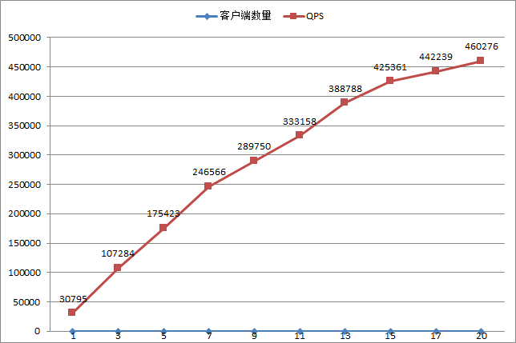

# rest_rpc
modern, simple, easy to use rpc framework.
# 真正好用的RPC框架rest_rpc

[rest_rpc](https://github.com/topcpporg/rest_rpc)是由c++开源技术社区([purecpp.org](purecpp.org))创建和发起的项目，在经过多次迭代和重构之后，终于发布第一个版本了。rest_rpc是modern c++开发的一个易用、灵活、跨平台和高性能的RPC框架。和国内外一些大公司开发的RPC框架相比，rest_rpc有哪些特色呢？

## rest_rpc的特点
[rest_rpc](https://github.com/topcpporg/rest_rpc)具备下面几个特点

- 真的像**本地函数**一样调用
- 使用简单，用户只需要关注业务即可
- 灵活，RPC调用的序列化方式可以自由定制，比如支持json，支持msgpack等方式
- 支持同步和异步调用

这几个特点也是之前的文章里提到的[评价一个RPC是否好用的标准](http://blog.csdn.net/qicosmos/article/details/52386920)，无疑rest_rpc完全符合这些标准，是一个真正好用的RPC，并且还走得更远。

传统的网络库处理业务逻辑的过程一般分为5步：

1. 接收网络数据；
2. 解析网络数据；
3. 调用业务逻辑；
4. 打包结果；
5. 发送数据；

如果使用rest_rpc，就只有1步了

1.只需要调用业务逻辑（其他的框架都帮你做好了）。

rest_rpc提供**一站式服务**，将1，2，4，5步完全省略掉，让用户只用关注第3步的业务逻辑即可，省心省力！如果用户之前用到了其他的网络库，想换成rest_rpc也很简单，不需要做任何修改，只要把业务逻辑函数注册一下就行了，可以直接复用，什么都不用改，省心省力！

rest_rpc的最主要的特点是好用，用户只需要像本地调用那样去调用RPC服务接口，无需关注框架和网络的细节既可以实现远程调用,只需要关注自己的业务逻辑即可。除了易用的特点之外，rest_rpc还具备很好的灵活性，用户可以选择RPC序列化的方式，还支持自定义的序列化方式。

## rest_rpc的使用

我们以一个最简单的例子来展示如何使用rest_rpc，这个例子中，服务器提供了一个 int add(int a, int b) RPC服务接口，客户端通过RPC调用获取远程调用的结果。

- 服务器端代码

		#include <rest_rpc/server.hpp>
		using namespace timax::rpc;
 
		int add(int a, int b)
		{
			return a + b;
		}

		int main()
		{
			using codec_type = msgpack_codec; //选择序列化方式，支持json,msgpack等种方式，可以自己扩展
			auto sp = std::make_shared<server<codec_type>>(port, thread_num); //创建server
			
			//注册业务逻辑处理函数，支持普通函数，函数对象，lambda,std::function和成员函数，你想用什么就用什么，没有任何限制
			sp->register_handler("add", add); 
	
			sp->start();
			std::getchar();		// replace with your server main loop
			sp->stop();
		}		
		
	
- 同步客户端代码

		#include <rest_rpc/client.hpp>
		using namespace timax::rpc;

		//定义调用约定，为了在编译期检查调用是否有误
		TIMAX_DEFINE_PROTOCOL(add, int(int, int));

		int main()
		{
			// 定义客户端类型为同步，序列化方式为msgpack
			sync_client<msgpack_codec> client; 
			
			// C++的客户端采用非面向连接的设计
			auto endpoint = get_tcp_endpoint("127.0.0.1", port); 

			// RPC调用
			// C++的rpc调用是类型安全的，call会帮用户做编译期参数类型检查，并支持C++函数形参的安全隐式类型转换
			auto result = client.call(endpoint, add, 1, 2); 
			assert(result == 3);

			// 安全的隐式类型转换，会把浮点数转换为int
			result = client.call(endpoint, add, 1.0, 2.0f);
			assert(result == 3);
		}

至此，一个RPC程序就完成了，无论是服务器还是客户端，代码都非常少，总共都不到10行代码，用户只需要关注业务逻辑即可，无需关注网络或者框架细节，而且和调用本地函数一样，非常好用，没有任何限制。

- 异步客户端代码

#### 一个更复杂的例子

这个例子将展示RPC接口中含有二进制数据的情况，有些RPC框架如果要支持二进制的话，需要将二进制做一些转换，比如base64转换之类的，rest_rpc支持原始的二进制数据，无需做任何转换。

- 服务器端代码

		#include <rest_rpc/server.hpp>
		using namespace timax::rpc;
		
		struct test
		{
			void compose(int i, const std::string& str, blob bl, double d)
			{
				std::cout << i << " " << str << " " << bl.ptr << " " << d << std::endl;
			}
		};

		int main()
		{
			using codec_type = msgpack_codec; //选择序列化方式，默认支持json,msgpack等种方式，可以自己扩展
			auto sp = std::make_shared<server<codec_type>>(port, thread_num); //创建server

			test t;

			// 使用timax::bind来绑定类的成员函数调用
			sp->register_handler("compose", timax::bind(&test::compose, &t)); 
	
			sp->start();
			// ...
		}	

- 客户端代码

		#include <rest_rpc/client.hpp>
		using namespace timax::rpc;

		//定义调用约定，为了在编译期检查调用是否有误
		TIMAX_DEFINE_PROTOCOL(compose, void(int, const std::string&, blob_t, double));

		int main()
		{
			sync_client<msgpack_codec> client; //定义客户端类型为同步，序列化方式为msgpack
			
			auto endpoint = get_tcp_endpoint("127.0.0.1", port); 

			client.call(endpoint, compose, 1, "test", blob_t("data", 4), 2.5); //RPC调用
		}
使用方式还是那么简单，自然，因为rest_rpc框架已经帮你做了绝大部分事情了。

## rest_rpc编译
rest_rpc是由c++14编写的，因此需要支持C++14的编译器，windwos上需要vs2015, linux需要gcc5.0+, 除此之外还用到了boost，因此还需要boost库。

## RPC调用需要注意的地方
需要注意的地方主要是就是客户端需要做异常处理，因为RPC调用可能会失败，出错的原因比较多，可能是客户端和服务器的连接断开了，也可能是服务器没有提供这个RPC服务，也可能是服务器提供的RPC服务发生了异常。总之，rest_rpc框架会将错误码和出错信息作为异常抛出来。所以更完整的做法是在call之外捕获一下异常，做异常处理。

		try
		{
			auto result = client.call(endpoint, client::add, 1, 2);
			assert(result == 3);
		}
		catch (timax::rpc::exception const& e)
		{
			std::cout << e.get_error_message() << std::endl;
		}

此外，服务器在默认情况下是在io线程中执行业务函数的，如果用户需要执行一个非常耗时的操作，rest_rpc提供了一个异步执行业务函数的接口。

		// .....
		namespace your_project
		{
			void some_task_takes_a_lot_of_time(double, int)
			{
				using namespace std::chrono_literals;
				std::this_thread::sleep_for(5s);
			}
		}
			
		int main()
		{
			// ....

			// 使用异步注册业务函数， 业务函数不会阻塞IO线程
			server->async_register_handler("time_consuming", 
				your_project::some_task_takes_a_lot_of_time);

			// ...
		} 

## 异步客户端
同步客户端会阻塞调用call的线程，虽然简化了逻辑但是也降低了性能。rest_rpc也实现了异步客户端，接口也很好用。

- 异步客户端示例

		#include <rest_rpc/rpc.hpp>

		namespace client
		{
			TIMAX_DEFINE_PROTOCOL(add, int(int, int));
		}

		int main()
		{
			using namespace std::chorno_literals;

			// 导出使用msgpack进行序列化的异步客户端
			using async_client_t = timax::rpc::async_client<timax::rpc::msgpack_codec>;

			// server的IP地址和端口号
			auto endpoint = get_tcp_endpoint("127.0.0.1", 9000);

			// 我们异步客户端对象实例
			async_client_t async_client;

			// 调用一个rpc，使用when_ok注册一个成功回调，when_error注册一个失败回调，并用timeout设置超时时间10秒
			async_client.call(endpoint, client::add, 1, 2).when_ok(
			{
				std::cout << r << std::endl;
			}).when_error(
			{
				std::cout << error.get_error_message() << std::endl;
			}).timeout(10s);

			std::getchar();
			return 0;
		}

- 异步客户端同步接口
异步客户端除了纯异步以外，还有同步接口，可以让用户选择在何时阻塞。

		#include <rest_rpc/rpc.hpp>

		namespace client
		{
			TIMAX_DEFINE_PROTOCOL(add, int(int, int));
		}

		int main()
		{
			// 同前面的异步客户端一样的代码
			using namespace std::chorno_literals;
			using async_client_t = timax::rpc::async_client<timax::rpc::msgpack_codec>;
			auto endpoint = get_tcp_endpoint("127.0.0.1", 9000);
			async_client_t async_client;

			// RPC调用接口会返回一个task，类似std::future
			auto task = client.call(endpoint, client::add, 1, 2);

			// 调用get会阻塞调用线程，直到超时或者结果返回
			// 请不要试图在多个线程同时调用get，rest_rpc没有保证get的线程安全性
			try
			{
				auto result = taks.get();
				// do something with the result ...
			}
			catch(timax::rpc::exception const& error)
			{
				// 服务器的错误返回，会以异常的形式抛给用户，相当于纯异步接口的when_error
				std::cout << error.get_error_message() << std::endl;
			}
			
			return 0;
		}

## 性能测试
rest_rpc的性能很高，下面是用同步客户端对add RPC服务接口做的性能测试结果，因为RPC是请求-响应模式，所以实际上做的是pingpang测试。

上面是在一台12核（主频2.4G）24线程的服务器上测试的，qps为46万时，cpu占用63%左右。

## 代码质量
下面是用工具检测的代码质量图

代码的可读性较好。

** 如果你仅仅需要RPC的话，看到这里就可以不用往下看了**。

如果你还有更多期待，请往下看。

## 还有点其他的什么吗？
是的，还有一些特别的东西，rest_rpc不是仅仅提供了一个RPC功能而已，还提供了更有趣的功能，比如订阅-发布!是的，你没看错，rest_rpc具备pub/sub功能，也许有人会觉得奇怪，为什么RPC框架会提供订阅-发布功能呢。其实，RPC和订阅-发布是有相通的地方。RPC可以看作是一个特殊的订阅-发布模式，即订阅者和发布者都是自己，而订阅-发布模式又可以看作是一个特殊的扩展了的RPC，即发起RPC调用的人和接收RPC调用结果的人是不同的人。正是看到了这种相通性，rest_rpc顺手就实现了订阅-发布模式。订阅-发布模式用起来也很简单，和RPC调用差不多，下面来看一个订阅发布的例子。

- 服务器端代码

		#include <rest_rpc/server.hpp>
		using namespace timax::rpc;
		
		int add(int a, int b)
		{
			return a + b;
		}

		int main()
		{
			using codec_type = msgpack_codec; //选择序列化方式，默认支持json,msgpack等种方式，可以自己扩展
			auto sp = std::make_shared<server<codec_type>>(port, thread_num); //创建server

			//服务器提供add主题
			sp->register_handler("sub_add", &add, [sp](auto conn, auto r) 
			{
				sp->pub("sub_add", r);         //向订阅该主题的客户端广播
			});
	
			sp->start();
			// .....
		}

- pub客户端代码

鉴于pub和sub天然的异步属性，我们只在异步客户端实现了这个接口，同步客户端暂不支持

		#include <rest_rpc/client.hpp>
		using namespace timax::rpc;

		TIMAX_DEFINE_PROTOCOL(sub_add, int(int, int));

		int main()
		{
			// ......

			async_client<msgpack_codec> client; //定义异步客户端，序列化方式为msgpack
			auto endpoint = get_tcp_endpoint("127.0.0.1", 9000);

			client.call(endpoint，sub_add, 1, 2); //pub本质上就是一个rpc调用

			// .....
		}

- sub客户端代码

		#include <rest_rpc/client.hpp>
		using namespace timax::rpc;

		TIMAX_DEFINE_PROTOCOL(sub_add, int(int, int));

		int main()
		{
			async_client<msgpack_codec> client;
			auto endpoint = get_tcp_endpoint("127.0.0.1", 9000);

			client.sub(endpoint, client::sub_add, 
			{
				std::cout << r << std::endl;
			});
			// ......
		}

订阅发布还是那么简单。rest_rpc相比其他的RPC框架，不仅仅提供了更加易用、灵活的RPC接口，还提供了额外的订阅发布功能，而且订阅-发布可以和RPC调用随时结合起来使用，使得RPC和订阅-发布的功能更加强大。

##Contributer

[江南（qicosmos）](https://github.com/qicosmos)，[IndignantAngel](https://github.com/IndignantAngel)
